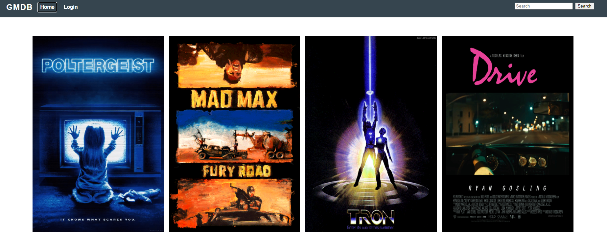
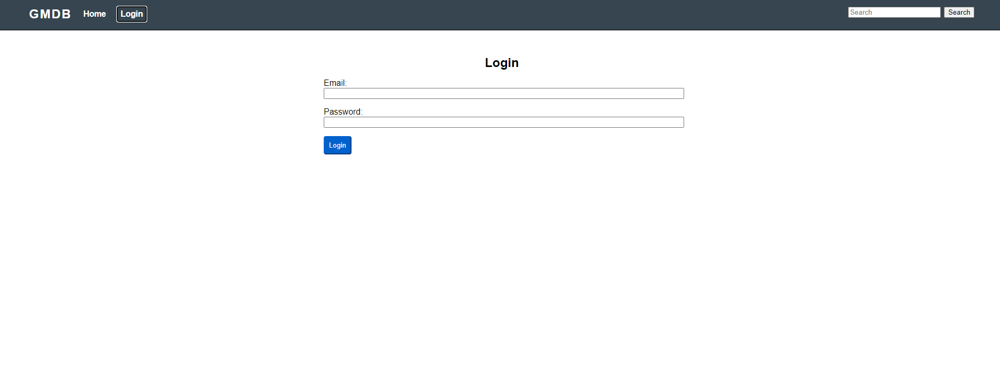

# USAF-html-checkpoint

You can add movies by going to scripts.js and adding an object with this format:

```js
{
  name: '',
  imagesrc: '',
  released: '',
  tags: [''],
  cast: [''],
  description: '',
}
```

to the `movies` array.

The search bar searches every movie's properies for a case insensitive partial match. So, you can search "Harris" to get every movie in which Harrison Ford starred, search "1987" to get all movies made in 1987, or search "action" to find all movies with the action tag.



